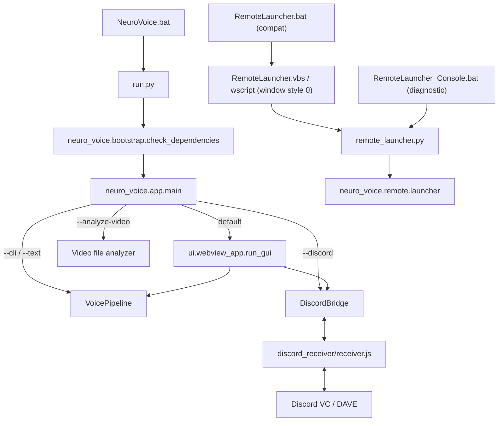
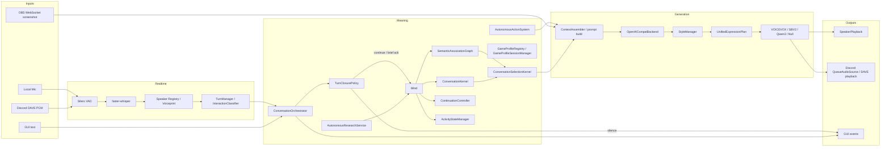
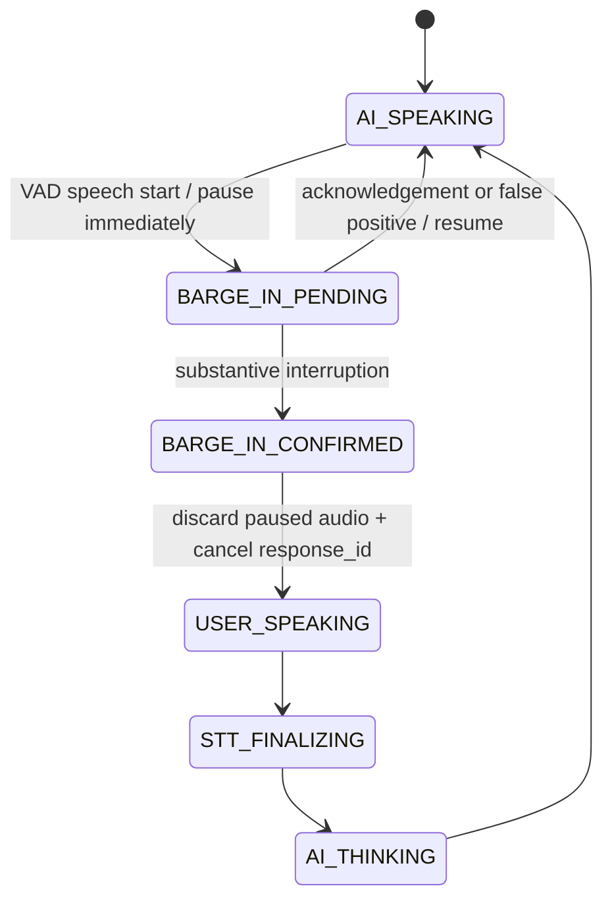

# 現行アーキテクチャ

## 2026-09-10 検索Evidence抽出・追質問・安全なTTS/UI診断

- `DeepSearch`のpage抽出は`main`、`article`、`role=main`、MediaWikiのcontent rootを優先し、nav/header/footer/aside/script/style/noscriptを根拠から除外する。HTML frameはclosing tagと照合してunwindし、void elementはstackへ積まないため、void/malformed markupが除外depthを後続本文へ漏らさない。本文rootのないgeneric HTMLでは見出し・段落・定義本文を順序どおり使い、global navigationの`li`はfallback対象にしない。
- 共有`SearchResultPresenter`はtitle/query一致だけでnavigation boilerplateを選ばず、cleanな関連snippetまたは安全な本文を優先する。BRIEF発話は支持された完全な事実文1〜2文、最大190文字。UI表示用excerptとは別に、process-local `SearchOutcome`へ再正規化可能な有界支持本文を保持し、Evidence hashと元source照合を維持する。raw HTMLや支持本文をLLM、Trace、永続Memoryへ渡さない。
- LocalとDiscordの`REUSE_EVIDENCE`はcached routeではなく現在の`SearchRouteDecision.answer_mode`で同じOutcomeを提示する。ENDINGはBRIEFのprimary relevant resultと同一resultだけに束縛し、`結末が有名/紹介`等のmeta言及を棄却してactual outcome cueを優先する。支持spanがなければ根拠不足を明示する。追質問で自動再検索せず、一つのTool実行契約を維持する。
- Local/DiscordのTTS例外は例外型と有効なHTTP statusだけへ縮約し、UIへURL/query/発話/response bodyを出さない。ログは同じ安全な診断、発話文字数、hashだけを保持する。top-level UIのsystem chipは`textContent`表示のまま選択・コピー可能で、改行保持・任意位置折返し・幅上限を持つ。CSS/DOM source契約はstatic test済みだがbrowser操作によるcopy/overflow受入は残る。
- Status: `CODE_VERIFIED / LOCAL HARDWARE RE-ACCEPTANCE PENDING`。本番DB、永続config、persona、既存Trace、backup、nested stale copyは変更していない。

## 2026-09-10 Stage M 記憶保持・bounded検索

- `MemoryStore`の`RetentionPolicy`はcanonicalな`memories`/`transcripts`を既定`retain`とし、旧startup/maintenance hookである`prune_transcripts()`と`prune()`は件数・年齢・重要度だけではsource行を削除・archiveしない。明示的なユーザー削除とprivacy訂正だけは理由付きAPIで物理削除でき、DO_NOT_STOREは保存前gateで拒否する。
- process内会話履歴は従来どおり有界、永続sourceは保持、embedding cacheと`*.search-index`は派生物、backupは復旧用の別寿命である。freshness正本はcanonical DBの永続revisionで、本文/ACL/status/time/vectorの変更だけが進める。touch/access count等は進めないため、Recallや再起動ごとの全再構築を行わない。
- 通常想起は既存necessity gate後にFTS5またはexact hash＋14表のdeterministic dense random-hyperplane ANNからbounded候補だけを取得する。各表は384次元すべてを16平面へ射影する。高類似度tierは4表×Hamming距離1×最大256行でcanonical cosineが.95以上なら停止し、それ以外は14表×距離2×最大1280行へ拡張する。fixed-seed 1000組のshared nomination率はcosine .72/.80/.90/.95/.99で95.6/99.2/100/100/100%。実働`top_k=5`ではMemory候補上限80、transcript候補上限40、最終context各5件であり、`Mind`がcanonical vectorとのcosineで最終順位を決める。
- 候補取得後はcanonical行へpersona/scopeとrequested statusを再適用する。source vectorはqueryと同じdim、float32長、finite、non-zeroを検査し、canonical rawから一度だけunit float32へ正規化する。sidecar buildのexact hash/dense ANN bucketと、選択したdoc/table/band/bucket provenanceの再導出は同じunit表現を使い、hydrate済みunitを再正規化しない。ID/vector/ACL/status/bucketが一件でも食い違えば、派生sidecar全体だけを一度再構築して同じqueryを最大一回再試行する。これにより不正approximate IDやwell-formedな別vectorの偽bucketが最終80/40を占有する場合、invalid/wrong-vector exact hitがfull ANNを隠す場合の双方で後方valid候補を復旧し、正常float32丸め差で不要repairしない。
- Memoryとtranscriptのsemantic候補は同じ派生sidecarに持つ。embedder warmupはモデルの一件入力だけで、永続Memory/transcript embeddingを起動時に全RAM展開しない。malformed SQLite、TABLE/VIEWを含むvalid SQLiteの不正schemaはconnectionを閉じ、canonicalへ触れずsidecarファイル全体だけをunlinkして一回再構築する。close→safe unlink→recreate/rebuildはStoreの単一reentrant lockと単一owner区間で行い、並行public searchは中間状態をopenしない。Windowsのfile-lock `PermissionError`はsemantic空候補またはlexical recent fallbackへ収束し、canonicalを削除しない。sidecarはcanonicalと同じdirectoryだけを許し、open前、open後、schema write直前にresolve/file identity/nlinkを再検査してsymlink/hardlink/差替えを拒否または切り離す。
- SQLite source write失敗は共通境界でrollbackし、storeをprocess内read-onlyへ倒して`MemoryWriteUnavailable`とcontent-free healthを返す。`touch/reinforce/mark/upgrade`も同じ境界を通る。`memory.write_enabled=false`のEpisodic/Mind想起はcanonical sourceを更新しない。完全migration済みDBのquery-only startupはretrieval可能なread-onlyへ退避し、旧schemaでmigrationが必要なのに書けない場合はconnectionを閉じて`MemoryStoreMigrationRequired`を返す。
- `MemoryStore.storage_health()`はcanonical/data/backup/sidecarの論理targetを所在volumeへまとめ、`shutil.disk_usage`で空き率をcontent-freeに測る。既定は20%未満を`warning`とし、`mind.storage.warning_free_percent`で変更できる。状態、空き率、閾値、測定path、対象label、probe失敗数は共有`Mind.status()`を通じてLocal/Discordと「こころ」画面へ同じ意味で出す。probe失敗は`unknown`で会話と書込み方針を継続し、低容量でもcanonical Memory/transcriptを自動削除せず、writeを自動で無効化しない。`:memory:`単体は測定対象がないため`unknown`とする。
- synthetic実vector 1k/10k/100kの隔離測定ではMemory/transcript両source件数不変。各100k（計20万source行）はlexical p50/p95 2.174/6.821ms、target cosine .99985・4-table-Hamming-1 fast実働`Mind` 9.541/10.374ms・transcript候補5.399/6.115ms、target cosine .90・14-table-Hamming-2 full実働`Mind` 358.708/367.410ms・transcript候補145.127/163.909ms。fast候補はMemory1/transcript1、full候補は上限の80/40、最終contextはいずれも各1/上限5。store reopen 5.754ms、sidecar build 208.847s、Python allocation peak 371,034,394 bytes、sidecar 320,561,152 bytes、Recall中/touch後restartのrebuild 0。full tierにはprovenance batch再導出を含み、14表×137 multiprobeと64種類vector反復の高衝突fixtureで品質・integrity gateを守るbounded検索コストである。一般semantic latencyや本番SLOとは呼ばない。buildは派生物の初回/更新コストで同じsource lockを保持する既知Minor。RAMはOS RSS/SQLite/filesystem page cacheを含まず、9回p95は探索値。reopen値はembedderモデルloadを含むアプリ全体のstartup値ではない。
- 同じOS directoryへ書ける悪意あるownerがsidecar行とmetadataを任意に一貫改変・削除する場合、検出不能な候補 omissionまで防ぐ可用性は保証しない。canonical ACL/status/vector再検査とprovenance照合はconfidentiality/integrityを守るが、sidecarを完全な信頼境界にはしない。OS directory ownershipと明示rebuild運用が残る防御である。
- 2026-09-10、ユーザー明示承認後の停止中に本番7 DBをSQLite online backupした。保存先は`data/backups/memory_retention_stage_m/20260910_074937_preindex`で、7 DBすべてintegrity OK、backup前後の件数とID・本文・summary・embedding指紋が一致した。隔離copyのmigration＋generation 8検証後、本番へ`memory_search_state`＋triggers（必要な一部DBはreflection persona/scopeも）を昇格しsidecarを作成した。canonical指紋不変、schema current、sidecar合計2,797,568 bytes、restart rebuild 0、既知Recall成功。`manifest.json`、`isolated_validation.json`、`production_promotion.json`を証跡とする。
- Status: `CODE_VERIFIED / USER-APPROVED PRODUCTION PROMOTION COMPLETE`。過去節・handoffの`PRODUCTION_DATA_UNTOUCHED`は当時の正しい履歴であり改変しない。容量警告追加では本番DB、persona/config、過去Trace、永続`memory.write_enabled`を変更していない。

## 2026-09-07 P0〜P2 会話品質・検索境界

- LocalとDiscordの明示検索は共有`SearchRouteDecision`へ入り、対象queryだけを既存検索実行境界へ渡す。BLOCKED/CLARIFY/DEFERREDは検索不要と区別され、process-local Evidence再利用はpersona/surface/audience/epoch/TTLへ束縛される。
- 検索結果はquery-awareな`SearchOutcome`とhash付き`EvidenceSpan`へ正規化してから決定的Presenterへ渡す。2026-09-10の実機回帰後、article-main抽出、navigation boilerplate棄却、完全なBRIEF文、現在route modeによるENDING再利用をこの共有境界へ追加した。本文は命令でなくuntrusted data。抽出整合のgroundedは真実性の保証ではない。
- P0 offline評価は27件のsynthetic fixtureだけを使い、未測定品質をnullで保持する。非削除契約Mは上のStage M節のとおりcode closeし、2026-09-10の別承認後にbackup・隔離検証・指紋照合を経て本番schema/sidecarへ昇格済み。実機会話品質の受入は引き続き別工程である。
- query+fetchは最大7秒の共有monotonic deadlineで有界化し、各I/Oは残時間だけを受け取る。Discordが使う共有`execute_search_route`は最大50ms間隔でownerを再検査し、同じ`is_current`をquery後・page開始前・redirect前へ渡すため、開始前cancel、検索中cancel後の待機継続・後続fetch、stale結果のcommitを拒否する。Local Tool経路は同じstrict deadlineと既存のresponse/delivery gateを使うが、この50ms pollingの直接利用までは主張しない。
- Status: `CODE_VERIFIED / HARDWARE_PENDING`。

- Snapshot: 2026-09-09

### Current Phase 8 Local production-session Tool boundary

- Only the existing `web_search.search` is wired as a Local PROD-session Tool probe. It is READ_ONLY, is enabled only in the current process by `ToolRuntime.set_read_only_session`, and does not persistently alter config or enable any write-capable tool.
- `VoicePipeline` proposes it only for an explicit read-only search request. Once execution begins, Legacy fallback is barred. A deterministic Result Presenter re-normalizes untrusted title/URL metadata plus a bounded, extractive Evidence View and produces one grounded short response plus one safe UI result display; HTML and raw Tool output never reach an LLM or TTS. Discord does not use the Local PROD Tool override, but its explicit DeepSearch response uses the same Evidence View rather than injecting raw search text into an LLM.
- Deterministic Tool responses now use the same `_speak_loop`/TurnTracker/Playback Coordinator as ordinary conversation. ActionOutcome closes only after a terminal delivery snapshot confirms completed logical playback segments; delivery finalization diagnostics are content-free Trace metadata.
- Scope: 実働ルート `C:\Users\coala\Desktop\Grok_API\Codex\AItuber`
- Confidence: 実コード・設定を静的追跡した`CONFIRMED`を中心に記載

この文書は理想設計ではなく、現在到達可能な実行経路を説明する。目標と不変条件は [PROJECT_CONSTITUTION.md](PROJECT_CONSTITUTION.md) を参照する。

## 1. 環境と起動

| 項目 | 現状 | 確度 |
|---|---|---|
| OS | Windows NT 10.0.26200 / PowerShell 5.1 | CONFIRMED |
| 言語 | Pythonが主体、Discord direct receiverはNode.js | CONFIRMED |
| Python | Python 3.11前提。実働rootの`.venv\Scripts\python.exe`で全テストを実行可能 | CONFIRMED |
| Node.js | v24.15.0、npm 11.12.1 | CONFIRMED |
| パッケージ | `requirements.txt`、`discord_receiver/package.json`、Style-Bert-VITS2外部tree | CONFIRMED |
| GUI起動 | `NeuroVoice.bat`または`run.py` | CONFIRMED |
| Remote起動 | `RemoteLauncher.vbs`（完全非表示）、互換`RemoteLauncher.bat`、診断用`RemoteLauncher_Console.bat`、`remote_launcher.py` | CONFIRMED |
| 設定 | `config/config.yaml`、値は`.env`参照可能 | CONFIRMED |
| ログ | `logs/` | CONFIRMED |
| 永続データ | `data/`のpersona別SQLite/JSON | CONFIRMED |
| モデル | `models/`、Ollama、Style-Bert-VITS2 tree | CONFIRMED |
| Git | 実働ルートの`.git`は空で、Git repoとして認識されない。`AItuber/`内に古いclean repoがある | CONFIRMED |

秘密値は調査・文書化していない。確認した環境変数名はAPI、Discord、OBS、Remote Launcher用であり、値をログやhandoffへ出してはならない。

## 2. エントリーポイントとプロセス



主プロセスはPython GUI/CLIである。Discord direct receiveではNode sidecarがDiscord RTP/Opus/DAVEを受け、IPC/WebSocketでPythonへPCM segmentと参加者イベントを渡す。Ollama、VOICEVOX、Style-Bert-VITS2、OBSは別プロセス/サービスである。

根拠: `run.py`、`neuro_voice/app.py`、`neuro_voice/ui/webview_app.py`、`neuro_voice/discord_bridge/direct_receiver.py`、`discord_receiver/receiver.js`。

## 3. コンポーネント



### 3.1 ゲームプロファイル

ゲーム固有の宣言データは`game_profiles/<game_id>/profile.json`が正本である。
`GameProfileRegistry`がフォルダを検証・列挙し、設定GUIも同じ一覧を使う。現在は
`minecraft`（映像を共有する相棒）と`keep_talking_and_nobody_explodes`
（画面を見ないマニュアル担当）がある。

`GameProfileSessionManager`はpersona別のゲームセッション状態を持ち、Local microphoneと
Discordから同じ`handle_final_input`契約を呼ぶ。KTaNEセッション中はMindのtool policyが
Web検索を拒否し、`vision_policy=manual_expert_no_bomb_view`により映像サービスを開始しない。
しりとりのCanonical Stateは引き続き`ActivityStateManager`が所有し、ゲームプロファイルの
役割/セッションと混在させない。

`VoicePipeline`と`DiscordBridge`は上図の多くをそれぞれ組み立てる巨大orchestratorである。`Mind`は共有されるが、response lifecycle、playback、autonomy runtime、検索挿入はsurface別実装である。final発話に対する会話参加判断は両surfaceで`ConversationOrchestrator`を共有し、その中の`TurnClosurePolicy`が、質問・訂正・依頼・Activity入力を保護した上で`SILENCE / BRIEF_ACK / CONTINUE`をLLM前に決める。終了相槌は検索・LLM・TTSへ進まず、相槌が`active_topic`を上書きした場合は直前の意味ある話題へ戻す。Directiveの手番待ちによる迂回は、`Mind.directive_waiting_for_user()`が`NARRATION / CO_THINKING`かつ`needs_user_input`の状態だけに限定する。通常`DIALOGUE`を誤って継続状態へしても、短い相槌を長文生成へ強制できない。

## 4. ローカル音声経路

```text
MicCapture callback
→ VoicePipeline._frame_q (maxsize=256)
→ VoicePipeline._vad_loop / SileroVAD
→ 発話開始: TurnManager + playback一時停止
→ interim STT（会話確定には使わない）
→ final audio segment
→ _start_respond / _respond
→ final STT + transcript repair
→ 音声感情分析と話者照合
→ ConversationOrchestrator.on_speech_final
→ TurnClosurePolicy（終了なら沈黙、一対一または明示的な感謝だけdirect短文）
→ Mind.begin_turn / context assembly
→ _start_response / respond_text
→ optional search
→ LLM stream
→ sentence_q
→ _speak_loop
→ TTS executor
→ SpeakerPlayback
→ PlayedTextTracker
```

`sentence_q`はターン内queueで、明示的maxsizeはない。入力frame queueは有界である。STT、TTS、vision、search、emotionは各1 workerの`ThreadPoolExecutor`を持つ。

final STTのdecode-time biasは、active persona名、現在の話者名、active状態のActivity名だけを
最大4語までhotwordsへ渡す。登録話者全員、終了済みActivity、過去transcriptは復号を歪めるため
渡さない。三個以上のcontext hotwordだけからなる短い末尾listが付加された場合は
`TranscriptRepairer`が`context_bias_echo_removed`として除去するが、名前一個を呼んだ通常文は
変更しない。final decodeは既定beam 5で、日本語固定・VAD後のsegmentを処理する。
短い音声をWhisperが「ご視聴ありがとうございました」等の動画末尾定型句へ誤認した場合は、
文字列一致だけでなく、発話時間から見た物理的不整合またはno-speech/logprobの弱い音声根拠を
満たす時だけ棄却する。正当な「ありがとうございました」「おやすみなさい」は一律blacklistしない。

音声デバイス監視は3秒間隔を既定とするが、通常pollはPortAudioのdevice一覧を読むだけで、
process-globalなterminate/initializeを行わない。`MicCapture.active`が実stream停止を検知した時だけ、
ユーザー発話・応答生成・再生がidleであることを確認して明示refreshと入力再接続を行う。
`SpeakerPlayback`はwrite時に停止を検知すると同じPCM blockを保持したままstreamを再構築し、
復旧不能なchunkはpartial完了としてturnを解放する。再生workerは次のTTSを受け付け続ける。

根拠: `neuro_voice/pipeline.py`の`VoicePipeline.__init__`、`run_voice`、`_vad_loop`、`_respond`、`respond_text`、`_speak_loop`。

## 5. Discord音声経路

```text
Discord VC
→ discord_receiver/receiver.js (RTP/Opus/DAVE)
→ DirectDAVEReceiver
→ account別VAD segment
→ DiscordBridge._utter_q (maxsize=3)
→ _respond_worker
→ _handle_utterance
→ final STT + speaker identity
→ ConversationOrchestrator
→ TurnClosurePolicy（終了なら沈黙、質問・依頼・Activityは継続）
→ Mind/context/search
→ LLM stream
→ TTS executor
→ QueueAudioSource またはdirect DAVE playback
→ Discord VC
```

主設定は`discord.receive_mode: direct_dave`。Windows loopbackはfallback/互換経路として残る。`discord.echo_text: false`なので通常は一般text channelへ音声応答を投稿しない。

Discord account IDは接続元account、voiceprintは実話者の候補であり、同一概念ではない。参加者一覧とjoin/leave eventはDiscord bridgeが管理する。

根拠: `neuro_voice/discord_bridge/bot.py`、`neuro_voice/discord_bridge/direct_receiver.py`、`discord_receiver/receiver.js`、`config/config.yaml`。

## 6. 割り込みとstale output



`PlayedTextTracker`はgenerated/queued/playing/played/unplayedをchunk IDとframe進捗で追跡する。hard interruption時はactive `response_id`をcancelし、LLM cancel、TTS queue、playbackへ伝播する。TTS完了後にもresponse validityを検査し、古いPCMの再出現を防ぐ。

ローカルは`SpeakerPlayback`、Discordは`QueueAudioSource`/direct playbackで実装が異なる。意味論は似ているがコード共有は未完了である。

根拠: `neuro_voice/realtime/turn_manager.py`、`neuro_voice/realtime/playback_tracker.py`、`neuro_voice/audio/playback.py`、`neuro_voice/pipeline.py`、`neuro_voice/discord_bridge/bot.py`。

## 7. 会話・記憶経路

```text
final utterance / event
→ PrivacyManager.classify
→ ConversationOrchestrator（応答要否）
→ Mind.begin_turn
→ DialogueIntelligence / ConversationKernel / WorkingMemory
→ ConversationSelectionKernel（返し方候補を比較し一つ選択）
→ SemanticAssociationGraph（短い関連候補。事実DBではない）
→ Memory retrieval
→ PrivacyManager.allow_context
→ ContextAssembler / prompt
→ context budget（トークン量で履歴を切り詰め、出力枠を確保）
→ LLM response
→ response sanitization / safe_output
→ Mind.end_turn
→ transcript、memory候補、relationship、temporal stateをpersona別保存
```

`Mind`はpersonaごとにMemory、Personality、Dialogue、Relationship、Temporal、Activity、Research、Speakerのstoreを構築する。会話中のsemantic/episodic抽出、検索、reflectionはexecutorで行う。通常の意味想起では、過去transcriptを話題の根拠として使うが、過去のassistant文面を表現例としてpromptへ再注入しない。同じユーザー発話が複数sessionにある場合は正規化して一件へ畳む。明示的な「前に何を話した／何を勧めた」等の会話参照だけは、事実照合に必要な過去assistant発話を利用できる。

会話人格は一枚の口調promptだけでなく、`curiosity`、`humor`、`playfulness`、
`cheekiness`、`spontaneity`、`emotional_expression`、`suggestion`、`contrarian`、
`empathy`、`topic_shift`の独立軸として保持する。`ConversationPlanner`が会話行為とshapeへ、
optional feature enginesがユーモア等の候補へ、`SurfaceRealizer`が最終的な話し言葉へ反映する。
ポッポの子供っぽさは幼児語や固定語尾ではなく、無邪気な反応、遊びへの乗り、文脈由来の
小さな冗談として表す。生意気さは親密度のある安全な雑談に限定し、support、correction、
quiet、seriousでは抑制する。

`ConversationPlanner`は各turnへ一つの主`conversation_move`（直接回答、短い反応、
意見、遊びの反応、話題展開、質問、修復、支援、根拠付き想起、思い出せない旨）を付ける。
2026-07-30以降、通常のMoveは`ConversationSelectionKernel`が複数候補を
relevance、continuity、social fit、novelty、直近反復、学習済みの小さな補正で比較する。
訂正・支援・履歴想起はhard obligationとして競争より優先する。候補ごとの返答文は生成せず、
選択後にメインLLMを一度だけ呼ぶため、Ollamaの直列実行と音声応答速度を悪化させない。
候補scoreと棄却理由は診断・学習用で、LLM promptやTTSへ出さない。
質問は独立Moveの時だけ許可し、通常質問へ義務的な追加質問を付けない。
`Mind`は明示的な過去会話質問と、実際に取得したmemory/transcript/referenceの有無を
Plannerへ渡す。`ConversationContract`は同じ`response_id`とsurfaceに限ってTTS直前と
final reply確定時に適用され、未計画の末尾質問、根拠のない過去会話主張、読書・視聴・
プレイ等の自己経験主張を音声・UI確定表示・履歴から除外または率直な非経験表現へ置換する。
生のstreamはprovisionalであり、UIは`assistant_done.text`で検証済み本文へ確定する。
契約は追加LLMを呼ばず、Local/Discordとも`DialogueIntelligence`所有の同じ意味論を使う。

AI発話直後の短いユーザーturnは、通常生成より先に`TurnClosurePolicy`が
`CONTINUE / SILENCE / BRIEF_ACK`へ分類する。「ほんとそれ」「マジでそう」のように
新しい内容を加えない口語同意は会話を閉じ、LLMを呼ばない。質問、訂正、依頼、Activity入力、
実行確認は終了相槌より優先する。生成まで進んだ場合も`ReplyEchoGuard`が最初のTTS文を保留し、
短い笑い・相槌しかない導入なら最大もう一文だけ待つ。導入だけを変えて直前assistant本文または
ユーザー発話を再述していればUI/TTS前に全体を抑止し、新しい内容なら保持分を一括解放する。
自己反復は直近assistant発話、オウム返しは現在user発話として別の閾値で判定し、短い定型導入だけを
反復確定しない。抑止後、明示訂正はcodeで確定し、それ以外は同じturn内で一度だけ「新内容または
`NO_REPLY`」を再生成する。再生成も反復なら発話せず自然に閉じる。Local/Discordが同じ
`turn_closure.py`、`echo.py`、`repair.py`の意味論を使う。

直前に選んだMoveへの次のユーザー反応は`ReactionLearner`が構造化する。明示的な肯定・否定・
反復指摘は強め、笑い・会話継続・終了相槌は弱めの証拠とし、Move重みを0.70〜1.30の範囲で
少しだけ更新する。割り込みや沈黙だけを不評とは扱わない。Discord groupでは発話本文を
適応DBへ複製せず、signal種別と集計値だけを保存する。

`SemanticAssociationGraph`はpersona別Adaptive SQLiteに、24文字以下のtopic nodeと
`co_occurs` / `corrected_to` edgeだけを保存する。これは正しい事実の正本ではなく、
話題を広げる場合の候補である。direct会話のgraphは同じ話者にだけ用い、Discord group由来の
edgeは現在runtime sessionかつ4時間TTLの範囲だけで利用する。PrivacyManagerが保存不可とした
turnはgraphへ入れない。

`UnifiedExpressionPlan`は同じ`response_id`でvoice（emotion、delivery、intensity、pace、
energy、laugh cue）と将来avatar（表情、仕草、視線、姿勢）を一つにする。現状はvoiceの
deliveryだけが既存StyleManager/TTSへ接続され、Local/Discordへ`expression_plan` eventを
`avatar_connected=false`で通知する。Avatarを操作するsinkはNo-opで、実デバイス・モデル・
アバター制御は存在しない。配信コメントも`ConversationAudienceMode.BROADCAST`と
`BroadcastCommentClusterer` protocolだけが将来境界として存在し、現在はreaderを接続しない。
LLM本文へ感情・styleタグを出させる契約は廃止済みである。旧モデルが
`[emotion: joyful]`等を出しても`EmotionTagParser`は型付きmetadataを値の既知/未知に関係なく
UI・履歴・TTSから除去する。日本語本文へ単独の英語下書き語が混ざった場合は
`SpokenOutputFilter`が限定語彙だけをstream境界込みで正規化し、OBS/Gemma/LLM等の技術語は残す。

「AっていうのはBっていう意味」のような明示訂正は`ConversationRepair`で構造化する。
訂正が直前の解釈を置換する場合、`ConversationManager`は割り込み時の未発話続きを通常文脈へ
再注入せず破棄する。ただし遮られたassistant全文は、履歴や事実ではなく直後の重複検知証拠として
有界保持する。Local/Discordは生成冒頭を通常assistant履歴、遮られた本文、現在のユーザー発話と
比較し、同じ誤回答の再出現を再生前に抑止する。抑止後のfallbackは、実際に検索結果を取得した時
だけ検索失敗を名乗り、訂正turnでは訂正内容の短い確認にする。

`interaction_policy.response_length`は永続的な好みであって各turnの命令ではない。
`ConversationPlanner`は明示的な「詳しく／短く」、発話量、intent、momentumを先に評価し、
永続値はsoft biasとしてだけ使う。直近返答の冒頭をSurfaceへ具体例として渡す
`recent_reply_avoidance`は追加LLMなし・既存のpersona別`recent_replies`だけを使うが、
2026-07-29の8turn自動A/Bで冒頭重複率に差がなかったため既定OFFの実験機能である。
有効化してもグループpromptではPrivacy境界により注入しない。
対話制御promptは候補score、棄却候補、重複したpersona数値をLLMへ再送せず、Pythonで
選択済みのstyle、shape、話題、任意表現だけを渡す。代表turnの実測は約1833→1281 token、
直近返答例1件を有効化した場合は約1374 token。

プライバシー境界は`PrivacyManager`にあり、グループpromptではprivate/legacy recordを拒否する設計である。ただし、主要`MemoryStore` schemaはowner/source audience/visibilityを列として保持していない。呼び出し側メタデータに依存する部分があり、憲法のTARGETを完全には満たさない。

文脈長は送信分と応答分で共有される。`neuro_voice/llm/context_budget.py`が送信直前にトークン量を見積もり、`llm.context_reserve_tokens`（既定`auto` = `max_tokens` + 余裕）だけ出力枠を確保してから古い往復を落とす。systemメッセージ（人格、Kernel判断、検索根拠）は落とさない。これを行わないと長文ターンの会話でプロンプトが`num_ctx`を埋め、応答が`finish_reason=length`で文の途中で切れる。

継続依頼のうち`needs_user_input`のもの（NARRATION、COLLABORATIVE_SESSION）は、通常返答自体をその依頼の手番として記録し`WAITING_FOR_USER`へ移る。返答後に区間を生成すると同じ問いを二度することになるためである。MONOLOGUEはこの規則の対象外で、自分から区間を出し続ける。

継続依頼の明示停止は、開始候補判定より常に優先する。`DirectiveRuntime`は停止を一つの取消トランザクションとして扱い、active Directiveだけでなく、解釈中plan task、区間task、LLM生成、未再生TTSを同じturnで無効化する。Local/Discordのsurface callbackはAutonomy heartbeatと自律発話taskも止め、既定300秒のpost-stop quietを設定する。quietは任意の新しい明示Directiveを妨げず、沈黙・open threadによる勝手な再開だけを抑止する。

根拠: `neuro_voice/mind/mind.py`、`neuro_voice/mind/store.py`、`neuro_voice/privacy.py`、
`neuro_voice/dialogue/working_memory.py`、`conversation_planner.py`、`surface_realizer.py`、
`conversation_contract.py`、`selection_kernel.py`、`reaction_learning.py`、
`semantic_graph.py`、`expression_plan.py`、`plan_metrics.py`、`neuro_voice/llm/context_budget.py`、
`neuro_voice/dialogue/continuation.py`。

## 8. 自律行動

```text
AutonomyHeartbeatScheduler (既定12秒)
→ Mind.research_heartbeat（queue保守 + grounded research producer）
→ BehaviorDirective due segment判定
→ AutonomousActionSystem.evaluate
→ ANSWER / COMMENT / REPORT_RESULT / WAIT / UPDATE_MEMORY / DO_NOTHING
→ floor、busy、cooldown、privacy、utility判定
→ surface別 autonomous turn
→ 通常と同じLLM/TTS/cancel経路
```

ローカルとDiscordはそれぞれ`AutonomousActionSystem`とheartbeatを持つ。`Mind`のContinuation/Directiveは共有される。`autonomous_action_system.enabled: true`では旧`proactive`ランダム発話を標準経路として使わない。`vision.mode: auto`のゲームコメントは独立したイベント源である。

自発発話の設定は「音声を出すか」のpolicyであり、schedulerの生存条件ではない。Local/Discordとも自発発話OFFでもHeartbeatを起動したままにし、発話callbackは`AutonomousActionSystem.active=false`で見送る一方、`Mind.research_heartbeat()`による研究queue保守とgrounded producerは継続する。Discordが音声surfaceを所有する間のLocal側suspendは、共有Mindを二重tickしないための所有権移譲として別に扱う。

継続トーク終了後は`AutonomousActionSystem.suppress_speech()`がlegacy continuationを消去し、`SILENCE_STARTED / SILENCE_CONTINUED / OPEN_THREAD_DUE`をquiet期限まで`DO_NOTHING`にする。停止後の同一話題の反復と連続独り言を避けるため、沈黙起点の発話は既定で5分あたり2回までである。

沈黙時の自発候補は、active theme、continuing thought、最近の具体話題、関心、現在時刻・気分を
個別のfocusとして扱い、そのうち直近で未使用の一件だけを選ぶ。同一・包含・高いbigram類似の
focusは再利用せず、全候補を使い切った場合は`DO_NOTHING`とする。LLMへ全材料を渡して毎回同じ
顕著な話題を選ばせない。質問は5分budget、cooldown、連続上限を満たす現在文脈のfocusだけで
許可し、それ以外は短い意見・気づきとして終える。

自発生成に使う内部指示はuser transcriptへ保存しない。一方、実際に読み上げた本文は
`ConversationManager`へassistant turnとしてcommitする。したがって次の人間発話は、ポッポが
直前に出した質問・意見の続きとしてLocal/Discord共通で解釈される。過去open-threadの自動callbackは
`autonomy.open_thread_callbacks_enabled=false`が既定で、明示的な継続依頼とは分離される。

根拠: `neuro_voice/autonomy/engine.py`、`neuro_voice/autonomy/heartbeat.py`、
`neuro_voice/memory/conversation.py`、`neuro_voice/dialogue/directive_runtime.py`、
`neuro_voice/pipeline.py`、`neuro_voice/discord_bridge/bot.py`。

## 9. 自律研究

```text
明示依頼 / 公開persona興味 / 一対一会話の事実知識gap
→ 理由付きResearchQuestion
→ ResearchGate
→ Query Sanitizer
→ privacy / risk / quota / duplicate判定
→ deque + single worker
→ DeepSearch.search_results
→ Evidence保存
→ source quality / 複数domain / official判定
→ VERIFIED または PROVISIONAL Knowledge
→ ReflectionとInterest更新
```

Heartbeat自身はtopicを発明しない。`Mind`がactive personaへ明記された公開の興味を
boundedな候補へ変換し、起動遅延・180分cooldown・quota・duplicate・risk gateを満たした一件だけを
`PERSONAL_CURIOSITY`として投入する。一対一会話で事実質問へ率直な非回答をした場合は
`KNOWLEDGE_GAP`を候補化するが、関係・感情・能力質問とgroup transcriptは対象外である。
workerは一度に一件で、前景busy時は待機する。検索ページは外部命令として実行せず、
prompt injectionらしき内容をEvidenceからrejectする。履歴はpersona別Research SQLiteに保存し、
GUIの「こころ → 自律研究・検索履歴」へ理由・状態・サニタイズ済み検索語を表示する。
自発発話のON/OFFには依存せず、`autonomous_research.enabled`とHeartbeat所有surfaceが有効なら研究を継続する。

根拠: `neuro_voice/research/service.py`、`neuro_voice/research/store.py`、
`neuro_voice/research/sanitizer.py`、`neuro_voice/mind/mind.py`、`neuro_voice/ui/assets/index.html`。

## 10. Activity

```text
Activity開始または入力
→ Activity入力分類
→ session / canonical state取得
→ proposal生成
→ normalize
→ validate（rule、turn、duplicate、version）
→ commit transaction / ledger
→ grounded output
→ TTS
```

`ActivityStateManager`がpersona別JSON snapshotとappend-only ledgerを所有する。しりとり等の個別品質はこの構造が存在することだけでは保証されず、各Activity validatorとテストが必要である。

根拠: `neuro_voice/activity/engine.py`、`neuro_voice/dialogue/kernel.py`、`tests/test_activity_*`、`tests/test_interaction.py`。

## 11. 視覚・OBS・GPU

OBS 28+のobs-websocket v5へ接続し、`GetSourceScreenshot`で指定sourceの現在frameを取得する。`VideoObservationService`は既定1fps、latest-frame-winsの有界dequeと短いraw historyを持つ。解析は同時一件に限定し、新しいpriority frameが来た場合に古い背景解析をcancelできる。

通常会話は解析済みの短いtext observationを使う。明示的な現在画面質問は新規frameを取得し、短いcontext/outputのreactive visual requestを使う。OBS失敗時に黙ってdesktopへfallbackしない。

Discordの画面共有映像は、CURRENTではDAVE sidecarから直接受信していない。`DiscordScreenShareSession`がOBS sourceを`VideoObservationService`へ接続し、「画面共有見て」で開始、「見るのやめて」またはVC退出で停止する。この開始・停止・視覚groundingはDiscord direct音声だけでなくLocal micからの同じ指示にも適用する。明示commandとactive session requesterの明示視覚質問は、複数人VCの通常addressee推定より優先する。

同じsessionは視覚sourceを明示的に切り替えられる。`discord_screen_share`はOBS `Discord画面共有`、汎用game profile、既定1280px幅を使い、Discord UI内の小さい共有領域と文字を保持する。`minecraft_obs`は「OBSのマイクラの画面を見て」で選択され、`discord.screen_share.minecraft_source_name`または通常の`video.obs.source_name`、Minecraft profile、既定768px幅を使う。source切替時は旧`VideoObservationService`を停止し、新sourceの初回frame/解析を開始する。Discord共有source未設定時に通常ゲームsourceへ暗黙fallbackしない。

active中は選択済みOBS sourceがそのconversation surfaceの視覚sourceを所有し、通常のmonitor 1取得へfallbackしない。会話へ渡すのは取得・解析時刻を持つ短期視覚状態で、raw frameは会話履歴へ保存せず、source kind/name付きUI previewだけに使う。

開始直後のcold/background解析は一件だけを共有し、通常の短い会話wait timeoutではcancelしない。一方、current-screen turnは「視覚だけで答えられる説明/OCR」と「視覚を根拠に考える判断/攻略」に分ける。どちらも質問前のin-flight解析をcancelし、質問時にOBSから再取得したframeへresponse generationを固定する。明示取得frameには`explicit_request_id`を記録し、UIの「いま見た画面」は現在turnのresponse/request IDと一致するframeだけを表示する。取得失敗時は前回の`last_explicit_frame`を消去し、通常会話のcontext構築はqueued/latest frameをUIへ再送しない。「今何が見える」「画面見てる？」「文字を読んで」等はstructured visionを短く直接発話し、同じ12B modelを二回呼ぶ遅延を避ける。「今の持ち物で作れる」「次はどうすれば」等は最大6.5秒fresh解析を待ち、同じresponse IDでは二重解析せず、その観測・公式Minecraft知識・通常Conversation Planner/LLMを統合して実際の質問へ答える。説明用formatterは`inventory_open`等の内部key/True/Falseを発話しない。直接説明が18秒以内に終わらない場合は旧観測を現在として代用せずtimeoutを明示し、判断質問は時刻付き直近状態へfallbackする。取得済み/意味解析中/解析済みを別状態として表示する。frame transportはOBSをCURRENTとし、将来DAVE decoded videoへ交換可能なsession境界を維持する。

Minecraft OBS sessionのbackground structured observationは、Local/Discordとも同じ`GameCompanionDirector`へ渡す。Directorは変化、confidence、importance、cooldown、semantic signatureで発話候補を選び、メニュー、ロード、静止画、通常歩行、重複eventを黙らせる。選ばれたeventは現在行動、player state、視覚根拠のある助言候補を保持し、会話のfloorが空いた時だけ通常のcancellable TTS経路で1〜2文のツッコミ・心配・発見反応・必要時の一手へ自然化する。「雨の夜、森を探索中」のようにsummaryを言い換えただけの情景ナレーションはSurface promptで禁止する。

Minecraftでは「今どこ」のような現在画面説明、「今の持ち物で作れる」「次はどうすれば」のような視覚根拠付き判断、「豚肉の焼き方」「材料」「レシピ」のような安定した攻略知識を別routingにする。安定知識はactive Java client JARから同期した公式recipeを材料名側から検索し、確定できる調理法はLocal/Discordとも映像推論・会話LLMより先に短文へ変換する。現在の持ち物・画面を根拠にした可否判断では、最新視覚観測と同じ公式recipeを通常会話生成へ渡し、見える材料・不足・判別不能を区別する。これにより画面上の見た目をゲーム規則の正本にせず、問いそのものをscene summaryへ置換しない。

GPUを一元的に予約する独立schedulerは確認できない。Pipelineのbusy checkと視覚側の単一task制約が実質的な調停であり、LLM/STT/TTSとの完全な優先制御は`TARGET`である。

根拠: `neuro_voice/vision/obs.py`、`neuro_voice/vision/video.py`、`neuro_voice/vision/service.py`、`neuro_voice/vision/discord_share.py`、`neuro_voice/games/minecraft_knowledge.py`、`neuro_voice/llm/openai_compat.py`。

## 12. 状態所有者

| 状態 | 所有者 | 永続化 | 重複/注意 |
|---|---|---|---|
| Persona選択 | Config/UI + Mind再構築 | config | TTS persona speakerと同期が必要 |
| Conversation history | ConversationManager/Mind | memory DB | 通常user/assistantと自発assistantを保持。内部autonomy指示は非永続 |
| Working thought | ConversationKernel/WorkingMemory | adaptive DB/JSON | promptだけでなく次turnへ更新 |
| Continuation/Directive | Mind配下controller/store | persona data | local/Discord共有 |
| Local response generation | VoicePipeline | 原則一時 | Discordと重複 |
| Discord response generation | DiscordBridge | 原則一時 | Localと重複。final input epochで最新入力が古い応答を失効 |
| Local playback | SpeakerPlayback | なし | response_id guard |
| Discord playback | QueueAudioSource/Direct receiver | なし | response_id guard。DAVE音楽時は単一mixed PCM writerでvoiceをduck |
| Activity | ActivityStateManager | JSON + ledger | canonical owner |
| AgentState | surface別AutonomousActionSystem | 主にruntime | 二重所有 |
| Memory | Mind/MemoryStore | SQLite | ACL metadata不足 |
| Research | AutonomousResearchService/ResearchStore | SQLite | single worker |
| Perception | PerceptionService/PerceptionMemory | RAM | stale ageを持つ |
| Relationship/Emotion/Time | Mind配下各engine | persona JSON/DB | persona分離 |

## 13. 常駐task、worker、queue

正確な同時数は起動modeとflagで変化する。以下は作成箇所を確認した論理workerであり、固定プロセス数ではない。

| Owner | task/worker | 条件 |
|---|---|---|
| GuiBackend | pipeline task、shutdown wait、LLM warmup | GUI |
| VoicePipeline | VAD loop、device watch、legacy/vision commentary、response、game commentary、autonomy | Local |
| VoicePipeline | STT/TTS/vision/search/emotion executors各1 | Local |
| DiscordBridge | respond worker、segment watchdog、proactive/autonomy、direct recovery、loopback fallback | Discord |
| DiscordBridge | STT/TTS executors各1 | Discord |
| Mind | mind executor、recall executor、reflection task | Mind enabled |
| AutonomyHeartbeatScheduler | periodic task | autonomy enabled |
| DirectiveRuntime | segment task/pending task | active directive |
| VideoObservationService | capture task、background analysis task | video enabled |
| AutonomousResearchService | single queue worker | pending research |

主要queue:

- Local `_frame_q`: `asyncio.Queue(maxsize=256)`
- Local `sentence_q`: turn-local、現在はunbounded
- Discord `_utter_q`: `asyncio.Queue(maxsize=3)`
- Discord loopback `_loop_q`: `asyncio.Queue(maxsize=64)`
- Discord playback `_chunks`: `deque`
- Vision latest frames: `deque(maxlen=1..2)`、raw historyも有界
- Research `_queue`: `deque`、persisted pending itemsから再投入
- GUI event buffer: `deque(maxlen=2000)`

## 14. データストア

| Store | 形式 | 主な内容 | retention/recovery |
|---|---|---|---|
| `mind_<persona>.db` | SQLite | memories、transcripts | pruneあり、schema version tableなし |
| `adaptive_<persona>.db` | SQLite | adaptive records、turn traces、schema metadata | 実装内migration |
| `research_<persona>.db` | SQLite | questions、runs、evidence、knowledge、reflection、interest | history retention、active knowledge保持 |
| `personality_<persona>.json` | JSON | personality state | save on update/close |
| `dialogue_<persona>.json` | JSON | dialogue state | save on update/close |
| `relationships_<persona>.json` | JSON | relationship | persona別 |
| `temporal_<persona>.json` | JSON | time awareness | persona別 |
| `temporal_self_<persona>.json` | JSON | active lifecycle | clean/unclean close |
| `activities_<persona>.json` | JSON/ledger | canonical activity/session | append-only event ledger |
| `speakers_<persona>.json` | JSON | voiceprints、aliases、identity links | persona別 |
| `minecraft_knowledge.db/json` | SQLite/JSON | Minecraft知識 | sync/version情報 |
| `logs/` | text/media diagnostics | runtime/latency/direct sidecar | retention統一なし |

BackupManagerはSQLite snapshotを作る。Windows file lock時の一時DB削除失敗は過去ログで確認されており、retry/cleanupの設計に注意が必要である。

## 15. 外部依存

- OllamaまたはOpenAI互換HTTP API: LLM/vision。
- faster-whisper、Silero VAD: STT/VAD。
- Style-Bert-VITS2、VOICEVOX、Qwen3-TTS: TTS。
- Discord API、Node/Dysnomia sidecar: VC。
- OBS WebSocket: game frame。
- Web search provider/ページ取得: DeepSearch。
- optional OpenSMILE/SpeechBrain: user emotion。
- optional AudD: music recognition。

### 15.1 TTS文分割とSBV2表現

`CURRENT / CONFIRMED`: LocalとDiscordは共通`SentenceSegmenter`でstream本文をTTS単位へ分ける。句点・疑問符・感嘆符は8文字以上で即時確定する。読点はsoft boundaryであり、20文字未満の短い節では確定せず後続節と一緒に合成する。preferred 30文字、hard ceiling 60文字の経路では、長文時も割り込み追跡可能な有界chunkを維持する。

SBV2はモデルの`/models/info`から利用可能styleを取得する。tsukuyomiのようにstyleが`Neutral`一つだけの場合、`style_weight`は設定基準値へ固定し、感情・継続気分は話速・音量等の有界表現へ限定する。複数styleモデルでは従来どおりemotion/delivery mappingとintonation倍率を使う。読み辞書は表示履歴を変えず合成テキストだけへ適用する。

`INVARIANT`: 割り込みの即時停止・response ID・played frame追跡のためのchunkingは維持するが、低遅延だけを理由に短い読点節を独立した文として発音させない。単一styleモデルへ存在しないstyleを捏造しない。

## 16. ACTIVE / Legacy / Experimental

| 区分 | モジュール/経路 | 根拠 |
|---|---|---|
| ACTIVE | GUI、VoicePipeline、Mind、ConversationKernel、Continuation、SBV2、faster-whisper | entry point/config/import |
| ACTIVE | Discord direct DAVE、ConversationOrchestrator | config/import/log path |
| ACTIVE | AutonomousActionSystem、Heartbeat、BehaviorDirective | config enabled/import |
| ACTIVE | AutonomousResearch | config enabled、Mind integration |
| PARTIALLY_ACTIVE | Vision/OBS、game assistant | feature flag既定OFF |
| PARTIALLY_ACTIVE | user emotion | enabledだがoptional dependency欠落時に自己無効化 |
| PARTIALLY_ACTIVE | Remote Launcher/PWA | 別entry point、通常GUIでは非必須 |
| LEGACY | `proactive` random mode、`legacy_spontaneous_mode` | config false、新autonomy時に抑止 |
| LEGACY/FALLBACK | Discord Windows loopback receive | direct DAVEがprimary |
| EXPERIMENTAL | Qwen3-TTS、Gemma audio input selector | factoryに存在、Gemma audioはWhisperへfallback |
| EXPERIMENTAL | window/screen direct game capture | OBS推奨、過去に安定性問題 |
| UNKNOWN | 未importの小規模utilityすべて | 動的importがあるため静的調査だけで断定しない |

## 17. 実装と文書の矛盾

1. README冒頭の単純な`Mic→VAD→STT→ConversationManager→LLM→TTS`図は、現在のMind/Kernel/Autonomy/Activity/Privacy/Discord direct receiveを表現しておらず`OUTDATED`。
2. READMEはQwen3-TTSを例示する箇所があるが、現設定のuser-facing backendはStyle-Bert-VITS2。factoryは複数backendを維持している。
3. READMEの「Discordはユーザーごとに音声が分離され、話者特定は確実」という表現は強すぎる。account sourceとvoiceprint identityは別である。
4. `config.yaml`にtop-level `privacy`が二回あり、`yaml.safe_load`では後のmappingが前を上書きする。media privacy値はコードdefaultに依存する。
5. `tts.backend`と`audio_output.backend`が併存する。factoryは`audio_output.backend`を優先するため、旧設定だけを見た説明は誤る。
6. 過去の設計文書は各改修時点の「実装済み」を記載するが、現行到達経路の保証書ではない。状態ラベルとsnapshot dateが必要。

## 18. NEEDS_CONFIRMATION

- 実働ルートと入れ子`AItuber/` Git repoの正式な関係、正本のremote/branch。
- 本番ハードウェアのGPU/VRAM、実測p95予算。
- Remote LauncherをLAN公開する実運用の有無。
- 音声・画像診断ファイルを保持する運用同意とretention。
- グループ会話のowner/allowlistモデル。
- LocalとDiscordを同時稼働させる正式な運用要件。
- 現在の全pytest結果。調査環境のPythonが壊れており実行できない。
<!-- Phase 7D Trace: `cognition.trace.enabled` creates a bounded background writer at `project_root/logs/cognitive_trace.jsonl`; normal local conversation emits after TurnFrame/Mind context without logging conversation text. Verified by one real GUI turn on 2026-08-04. -->
<!-- Phase 7D retrieval repair: local normal turns call the bounded Mind recall path. Strict Store reads are bound to the active persona; a missing semantic index falls back to that scoped lexical reader, and stored recall questions are never evidence. `memory.write_enabled=false` is a retrieval-only guard that blocks episode/transcript/access mutations for controlled smoke turns. Explicit passphrase recall, including its ASR-tolerant label/verb form, is a deterministic response contract: FOUND speaks the extracted fact, NOT_FOUND says it is not remembered before TTS and logs zero recall LLM calls. Trace records only stage counts/hashes/status, never the retrieval query/body. Runtime verification remains pending. -->
<!-- 2026-08-05: ContextAssembler is the Local retrieval caller. A positive recall budget is a timeout budget only: include_recall is true exclusively when the no-LLM trigger returns an explicit past/labelled-recall reason; otherwise Trace is NOT_APPLICABLE/not_applicable and no Memory search runs. -->
<!-- 2026-08-05 obligation gate: a current-turn ConversationKernel response duty is never a recall obligation. Only active same-persona WorkingMemory open questions may trigger obligation retrieval, and only on explicit resumption, deterministic topic/entity overlap, or a selected continuation action. Due work becomes OBLIGATION_DUE attention for Initiative; it is never silently injected into an unrelated ANSWER. -->
<!-- 2026-08-05 explicit-answer delivery: ReplyEchoGuard historical similarity may cause at most one regeneration but never turns an addressed ANSWER into silence. The unshipped primary is retained if regeneration is empty or historically similar. Same-turn duplicate delivery remains the SpeechRequest/Playback ledger's hard gate. A cognitive ANSWER is failed, not completed, without a logical playback session; Trace records only safe resolution/status fields. -->
<!-- Phase 7D latency/delivery: Local and Discord both carry `TurnMetrics`; Local now owns the same bounded `LatencyWindow` already used by Discord. Final normal-turn Trace stores the safe `turn_latency` snapshot (total=speech_end→play_start), source-separated rolling percentile summary, and SpeechRequest→TTS→Playback attempted/accepted/rejected counts. Local/Discord may share the JSONL; background append is serialized. A 30-turn Local measurement and one real Discord Trace turn remain required. -->
<!-- 2026-08-05: Trace also includes llm_diagnostics only: build ms, prompt-token estimate/reuse, retrieved count, first-token timing, queue contention, and native provider durations if exposed. No prompt or transcript is persisted. -->
<!-- 2026-08-05 cognition test session: UI or `--cognition-test-session` enables cognition only in the live process. A pending change applies between turns, increments an epoch, and each Local TurnMetrics/TurnFrame freezes enabled/mode/epoch. Trace exposes that contract plus selector/gate/legacy-path and SpeechRequest count; restart returns to Legacy. -->
<!-- 2026-08-05 Trace vocabulary: `cognition.rollout_mode` is the frozen configured/effective rollout value (`disabled` or `test_session`); `cognition.execution_path` is separately `legacy` or `cognitive`. Historical JSONL is append-only and is not rewritten. -->
<!-- 2026-08-06 Phase 8: `CognitionRolloutResolver` is the single source of effective mode. TEST/PROD SESSION are process-local and reset on restart; only explicit `production` config persists. Local/Discord turns freeze requested/resolved rollout, source, fingerprint, transport, epoch, and execution path. Technical Legacy fallback is one-shot and forbidden after delivery/tool/memory effects. -->
<!-- 2026-08-06 Phase 8 silence contract: only an Action Selector REMAIN_SILENT with decision ID, source, reason code, zero SpeechRequest, and completed closure may be silent_completed. Only ResponsePlan's addressed answer/continuation intent becomes the frozen response-required contract; activity input and acknowledgement plans still reach their owner without overriding a valid end signal. Memory influence remains an adjustment only. An incomplete silent decision is a pre-effect technical fallback/failed outcome, never a normal silence. -->
<!-- 2026-08-07 Phase 8 closure eligibility: the existing closure detectors freeze a text-free ActionEligibility before selection. Closure-only allows only REMAIN_SILENT/BRIEF_ACKNOWLEDGE; direct question allows ANSWER; an explicit reply request allows BRIEF_ACKNOWLEDGE. ActionConstraintValidator rejects an ineligible selector result before planner/realizer, without an LLM retry or Legacy fallback. -->
